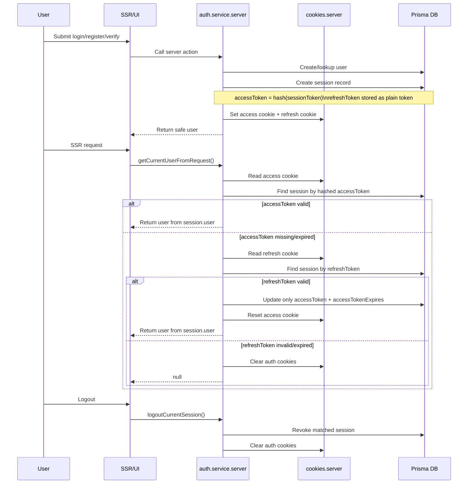
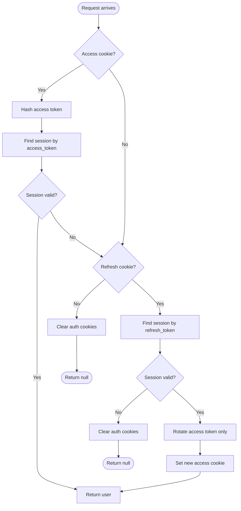

# Auth Flow

Sơ đồ này mô tả đúng luồng auth hiện tại của source:
- `accessToken` sống ngắn hạn, lưu ở cookie và được hash trong DB
- `refreshToken` sống dài hơn, lưu ở cookie và DB
- SSR là nguồn sự thật, client chỉ hydrate từ server

## Sequence

## State Flow

## Notes

- `accessToken` đổi mỗi lần refresh access session, nhưng `deviceInfo` không đổi.
- `refreshToken` dùng để kéo dài phiên đăng nhập.
- `createSessionRecord()` tạo session mới cho mỗi lần đăng nhập/verify khác nhau.
- `updateSessionAccessToken()` chỉ update record hiện tại, không tạo session mới.
- Khi logout, session hiện tại bị revoke và cookies bị xóa.
