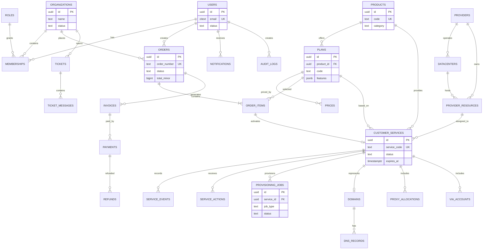
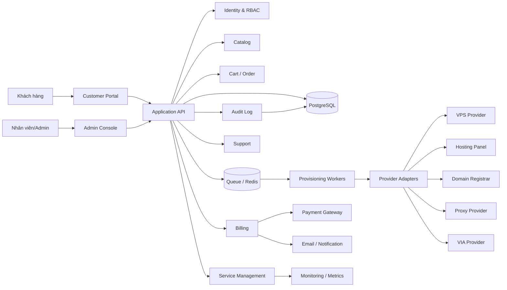
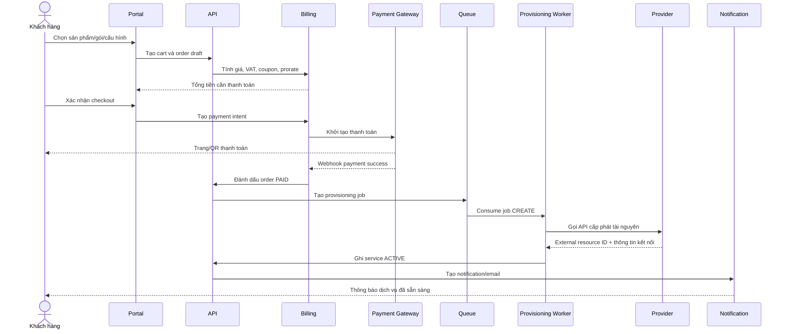
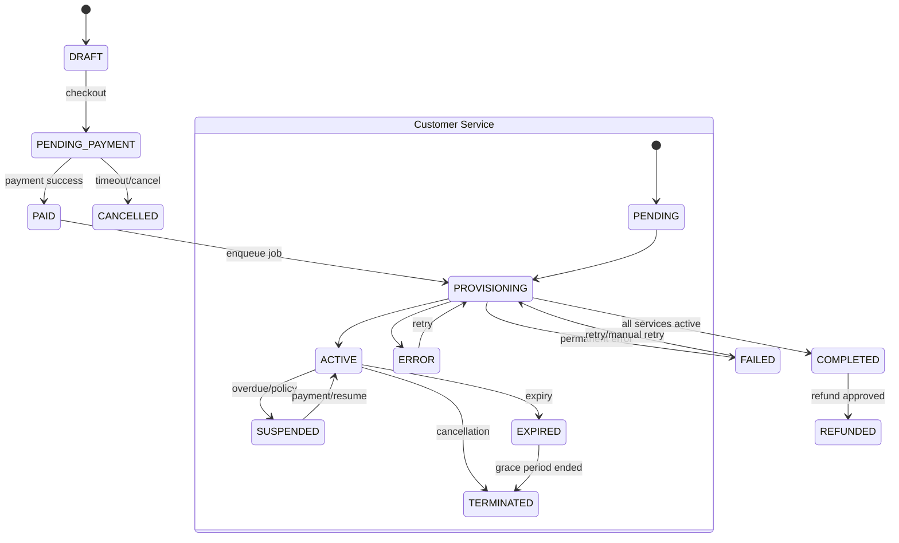
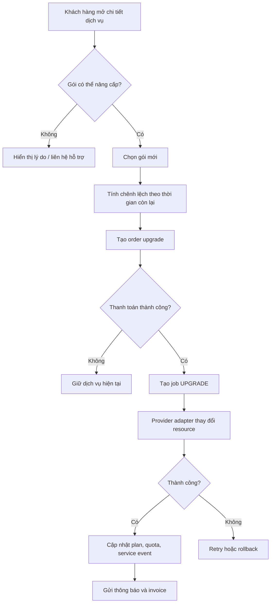
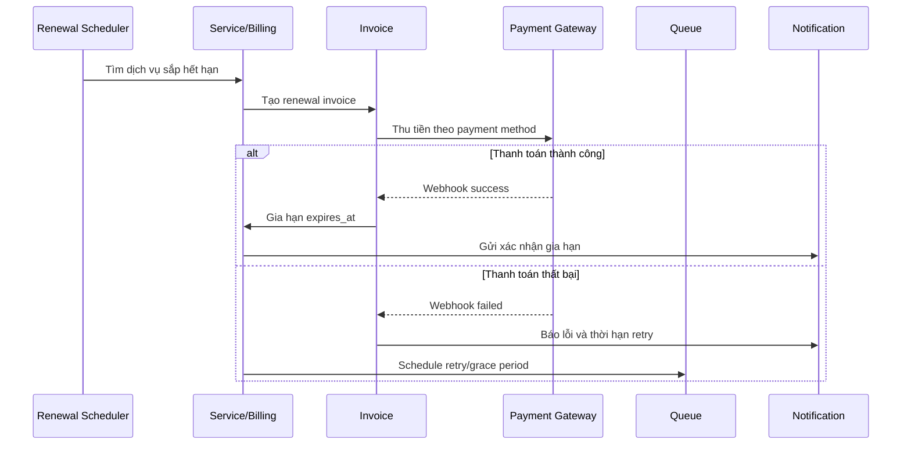
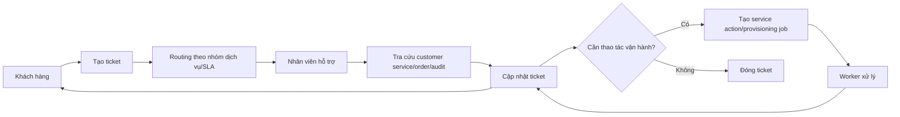

# Thiết kế database và sơ đồ hệ thống

Tài liệu này bổ sung cho [plan phát triển nền tảng](./vps-service-management-platform-plan.md). Các sơ đồ dùng Mermaid để có thể xem trực tiếp trên GitHub.

## 1. Nguyên tắc thiết kế database

- PostgreSQL là database chính.
- Mỗi bảng có `id` dạng UUID/UUIDv7, `created_at`, `updated_at`.
- Tiền tệ lưu bằng số nguyên theo đơn vị nhỏ nhất, ví dụ `amount_minor`.
- Trạng thái nghiệp vụ dùng enum hoặc bảng trạng thái có version.
- Không lưu password, token thanh toán hoặc secret provider dạng plain text.
- Dữ liệu credential mã hóa bằng KMS/secret vault; database chỉ lưu reference hoặc ciphertext.
- Các thao tác thanh toán, webhook và provisioning phải có idempotency key.
- Không xóa cứng dữ liệu tài chính, order, invoice và audit log.

## 2. Phân vùng module dữ liệu

| Module | Trách nhiệm | Bảng chính |
|---|---|---|
| Identity | Người dùng, organization, quyền | `users`, `organizations`, `memberships`, `roles`, `permissions` |
| Catalog | Sản phẩm, gói, tính năng, giá | `products`, `plans`, `prices`, `addons` |
| Commerce | Giỏ hàng, order, coupon | `carts`, `cart_items`, `orders`, `order_items`, `coupons` |
| Billing | Invoice, payment, refund, credit | `invoices`, `payments`, `refunds`, `credits` |
| Services | Dịch vụ khách hàng và vòng đời | `customer_services`, `service_events`, `service_actions` |
| Infrastructure | Provider, node, IP, capacity | `providers`, `datacenters`, `resources`, `ip_pools` |
| Provisioning | Job cấp phát/thay đổi dịch vụ | `provisioning_jobs`, `job_attempts` |
| Domain/Proxy/VIA | Tài nguyên dịch vụ chuyên biệt | `domains`, `dns_records`, `proxy_allocations`, `via_accounts` |
| Support | Ticket, SLA, thông báo | `tickets`, `ticket_messages`, `notifications` |
| Audit | Theo dõi thao tác và thay đổi | `audit_logs` |

## 3. Quy ước group module khi code

Source hiện tại dùng convention frontend `src/features/<area>/<feature>` và backend `server/modules/<parent-module>/<child-module>`. Frontend cần tách rõ `admin` và `customer`; backend cần gom các module con vào module cha/domain lớn như `identity`, `catalog`, `commerce` và `billing`.

```text
ssr-base/
├── src/features/
│   ├── auth/             # auth context, guards, hooks, pages, services, store, types
│   ├── admin/            # frontend dành cho admin
│   │   ├── appearance/
│   │   ├── audit/
│   │   ├── dashboard/
│   │   ├── media/
│   │   ├── posts/
│   │   ├── system/
│   │   └── users/
│   └── customer/         # frontend dành cho khách hàng đã đăng nhập
│       ├── dashboard/
│       ├── services/
│       ├── catalog/
│       ├── commerce/
│       ├── billing/
│       ├── domains/
│       ├── proxies/
│       ├── via/
│       ├── support/
│       ├── notifications/
│       └── settings/
├── src/components/       # common, editor, form, provider, table, ui
├── src/layouts/          # blank, full, header, sidebar
├── src/routes/           # route composition
├── src/config/           # API, app info, i18n
├── server/modules/
│   ├── identity/
│   │   ├── users/
│   │   ├── organizations/
│   │   ├── memberships/
│   │   ├── roles/
│   │   ├── permissions/
│   │   ├── auth/
│   │   └── api-keys/
│   ├── catalog/
│   │   ├── products/
│   │   ├── plans/
│   │   ├── prices/
│   │   └── addons/
│   ├── commerce/
│   │   ├── carts/
│   │   ├── orders/
│   │   └── coupons/
│   ├── billing/
│   │   ├── invoices/
│   │   ├── payments/
│   │   └── refunds/
│   ├── services/             # Dịch vụ khách hàng và vòng đời
│   │   ├── customer-services/
│   │   ├── service-events/
│   │   └── service-actions/
│   ├── infrastructure/       # Provider, node, IP, capacity
│   │   ├── providers/
│   │   ├── datacenters/
│   │   ├── resources/
│   │   └── ip-pools/
│   ├── provisioning/         # Job cấp phát/thay đổi dịch vụ
│   │   ├── provisioning-jobs/
│   │   └── job-attempts/
│   ├── domain-proxy-via/     # Domain / Proxy / VIA
│   │   ├── domains/
│   │   ├── dns-records/
│   │   ├── proxy-allocations/
│   │   └── via-accounts/
│   ├── support/              # Ticket, SLA, thông báo
│   │   ├── tickets/
│   │   ├── ticket-messages/
│   │   └── notifications/
│   └── audit/                # Theo dõi thao tác và thay đổi
│       └── audit-logs/
├── server/common/        # error, auth context, cookies, mailer, pagination
├── server/db/            # Prisma client
├── server/admin/         # admin-only adapters không thuộc data-domain
│   ├── appearance/
│   ├── media/
│   ├── posts/
│   └── system/
├── server/third-party/   # S3 và provider adapter
├── shared/               # contract/type client-server
└── prisma/               # schema, migrations, seed, generated
```

Các module con mới chưa cần tạo trước nếu chưa có use case hoặc database migration tương ứng. Mọi module backend mới phải thuộc một trong 10 vùng dữ liệu: `identity`, `catalog`, `commerce`, `billing`, `services`, `infrastructure`, `provisioning`, `domain-proxy-via`, `support`, `audit`. Các module hiện có như `server/modules/users` có thể được di chuyển dần vào `server/modules/identity/users` trong một migration/refactor riêng. Các module `appearance`, `media`, `posts`, `system` hiện có cần được phân loại vào vùng dữ liệu phù hợp hoặc chuyển thành phần dùng chung/admin adapter, không tạo thêm module cha ngoài taxonomy này.

Trong source hiện tại, các module identity/audit đã được gom về `server/modules/identity/{users,auth,api-keys}` và `server/modules/audit/audit-logs`. Các module chỉ phục vụ admin (`appearance`, `media`, `posts`, `system`) được đặt tại `server/admin` vì chúng không sở hữu một data-domain mới trong taxonomy.

### Quy tắc phụ thuộc

- `src/features/admin/<feature>` chỉ chứa UI/use case dành cho admin.
- `src/features/customer/<feature>` chỉ chứa UI/use case dành cho khách hàng đã đăng nhập.
- `src/features/<area>/<feature>` gọi API/server function, không truy cập Prisma trực tiếp.
- `server/modules/<parent>/<child>` sở hữu schema, service/use case, repository và server function liên quan.
- `server/db` là nơi khởi tạo Prisma client; repository là nơi duy nhất truy cập Prisma/SQL.
- `provisioning` chỉ gọi provider thông qua adapter interface.
- `src/features/<area>/<feature>` và `server/modules/<parent>/<child>` giao tiếp qua API/contract rõ ràng.
- Module khác chỉ dùng public service/contract, không import file nội bộ.
- `shared` không được chứa logic riêng của Catalog, Billing hoặc một domain cụ thể.
- Mỗi module nên có test gần source hoặc trong thư mục `__tests__` của chính module đó.

## 4. Các bảng cốt lõi

### Identity và quyền

```sql
users (
  id uuid primary key,
  email citext unique not null,
  username citext unique,
  password_hash text not null,
  full_name text,
  status text not null, -- ACTIVE, SUSPENDED, DELETED
  mfa_enabled boolean not null default false,
  email_verified_at timestamptz,
  created_at timestamptz not null,
  updated_at timestamptz not null
)

organizations (
  id uuid primary key,
  name text not null,
  billing_email citext,
  status text not null,
  created_at timestamptz not null,
  updated_at timestamptz not null
)

memberships (
  organization_id uuid references organizations(id),
  user_id uuid references users(id),
  role_id uuid references roles(id),
  status text not null,
  primary key (organization_id, user_id)
)

roles (
  id uuid primary key,
  organization_id uuid references organizations(id),
  code text not null,
  name text not null,
  is_system boolean not null default false,
  unique (organization_id, code)
)
```

### Catalog và pricing

```sql
products (
  id uuid primary key,
  code text unique not null,
  category text not null, -- VPS, HOSTING, DEDICATED, VIA, PROXY, DOMAIN, ADDON
  name text not null,
  description text,
  status text not null, -- DRAFT, ACTIVE, ARCHIVED
  metadata jsonb not null default '{}'
)

plans (
  id uuid primary key,
  product_id uuid references products(id),
  code text not null,
  name text not null,
  is_custom boolean not null default false,
  features jsonb not null default '{}',
  status text not null,
  unique (product_id, code)
)

prices (
  id uuid primary key,
  plan_id uuid references plans(id),
  currency char(3) not null,
  billing_cycle text not null, -- MONTH, QUARTER, YEAR, ONE_TIME
  amount_minor bigint not null,
  setup_fee_minor bigint not null default 0,
  effective_from timestamptz not null,
  effective_to timestamptz,
  status text not null
)

addons (
  id uuid primary key,
  product_id uuid references products(id),
  code text unique not null,
  name text not null,
  pricing jsonb not null,
  status text not null
)
```

### Order, billing và thanh toán

```sql
orders (
  id uuid primary key,
  order_number text unique not null,
  organization_id uuid references organizations(id),
  user_id uuid references users(id),
  status text not null, -- DRAFT, PENDING_PAYMENT, PAID, PROVISIONING, COMPLETED, FAILED, CANCELLED
  currency char(3) not null,
  subtotal_minor bigint not null,
  discount_minor bigint not null default 0,
  tax_minor bigint not null default 0,
  total_minor bigint not null,
  idempotency_key text unique,
  created_at timestamptz not null,
  updated_at timestamptz not null
)

order_items (
  id uuid primary key,
  order_id uuid references orders(id),
  product_id uuid references products(id),
  plan_id uuid references plans(id),
  addon_id uuid references addons(id),
  quantity integer not null default 1,
  configuration jsonb not null default '{}',
  period_start timestamptz,
  period_end timestamptz,
  unit_amount_minor bigint not null,
  total_amount_minor bigint not null
)

invoices (
  id uuid primary key,
  invoice_number text unique not null,
  organization_id uuid references organizations(id),
  order_id uuid references orders(id),
  status text not null, -- OPEN, PAID, VOID, OVERDUE, REFUNDED
  due_at timestamptz,
  paid_at timestamptz,
  total_minor bigint not null,
  pdf_object_key text
)

payments (
  id uuid primary key,
  invoice_id uuid references invoices(id),
  provider text not null,
  provider_payment_id text,
  status text not null, -- CREATED, PENDING, SUCCEEDED, FAILED, REFUNDED
  amount_minor bigint not null,
  currency char(3) not null,
  raw_response jsonb,
  unique (provider, provider_payment_id)
)

refunds (
  id uuid primary key,
  payment_id uuid references payments(id),
  amount_minor bigint not null,
  reason text,
  status text not null,
  provider_refund_id text
)
```

### Dịch vụ khách hàng và provisioning

```sql
customer_services (
  id uuid primary key,
  organization_id uuid references organizations(id),
  order_item_id uuid references order_items(id),
  product_id uuid references products(id),
  plan_id uuid references plans(id),
  service_code text unique not null,
  status text not null, -- PENDING, PROVISIONING, ACTIVE, SUSPENDED, EXPIRED, TERMINATED, ERROR
  provider_resource_id uuid references provider_resources(id),
  configuration jsonb not null default '{}',
  activated_at timestamptz,
  expires_at timestamptz,
  suspended_at timestamptz,
  terminated_at timestamptz
)

service_events (
  id uuid primary key,
  service_id uuid references customer_services(id),
  event_type text not null,
  from_status text,
  to_status text,
  payload jsonb not null default '{}',
  created_by uuid references users(id),
  created_at timestamptz not null
)

service_actions (
  id uuid primary key,
  service_id uuid references customer_services(id),
  action text not null, -- REBOOT, REBUILD, SNAPSHOT, UPGRADE, RENEW, SUSPEND
  status text not null,
  requested_by uuid references users(id),
  idempotency_key text unique,
  requested_at timestamptz not null,
  completed_at timestamptz
)

provisioning_jobs (
  id uuid primary key,
  service_id uuid references customer_services(id),
  order_id uuid references orders(id),
  job_type text not null, -- CREATE, UPDATE, UPGRADE, RENEW, SUSPEND, TERMINATE
  status text not null, -- QUEUED, RUNNING, SUCCEEDED, FAILED, RETRYING, CANCELLED
  attempts integer not null default 0,
  payload jsonb not null default '{}',
  error_code text,
  error_message text,
  available_at timestamptz not null,
  started_at timestamptz,
  completed_at timestamptz
)
```

### Infrastructure và dịch vụ chuyên biệt

```sql
providers (
  id uuid primary key,
  code text unique not null,
  provider_type text not null, -- PROXMOX, CPANEL, REGISTRAR, PROXY, CUSTOM
  credential_ref text not null,
  status text not null,
  config jsonb not null default '{}'
)

datacenters (
  id uuid primary key,
  provider_id uuid references providers(id),
  code text unique not null,
  name text not null,
  country_code char(2) not null,
  city text,
  timezone text,
  status text not null
)

provider_resources (
  id uuid primary key,
  provider_id uuid references providers(id),
  datacenter_id uuid references datacenters(id),
  resource_type text not null, -- NODE, VM, SERVER, HOSTING_ACCOUNT, IP
  external_id text not null,
  capacity jsonb not null default '{}',
  status text not null,
  unique (provider_id, resource_type, external_id)
)

domains (
  id uuid primary key,
  organization_id uuid references organizations(id),
  service_id uuid references customer_services(id),
  domain_name citext unique not null,
  registrar text,
  status text not null,
  registered_at timestamptz,
  expires_at timestamptz,
  auto_renew boolean not null default false
)

dns_records (
  id uuid primary key,
  domain_id uuid references domains(id),
  record_type text not null,
  name text not null,
  value text not null,
  ttl integer not null default 300,
  priority integer
)

proxy_allocations (
  id uuid primary key,
  service_id uuid references customer_services(id),
  protocol text not null,
  host text not null,
  port integer not null,
  username_ref text,
  password_ref text,
  location text,
  status text not null
)

via_accounts (
  id uuid primary key,
  service_id uuid references customer_services(id),
  account_type text not null,
  country_code char(2),
  credential_ref text not null,
  status text not null,
  expires_at timestamptz
)
```

### Support, notification và audit

```sql
tickets (
  id uuid primary key,
  organization_id uuid references organizations(id),
  service_id uuid references customer_services(id),
  created_by uuid references users(id),
  assigned_to uuid references users(id),
  priority text not null,
  status text not null,
  subject text not null,
  sla_due_at timestamptz,
  created_at timestamptz not null,
  updated_at timestamptz not null
)

ticket_messages (
  id uuid primary key,
  ticket_id uuid references tickets(id),
  author_id uuid references users(id),
  body text not null,
  attachments jsonb not null default '[]',
  created_at timestamptz not null
)

notifications (
  id uuid primary key,
  user_id uuid references users(id),
  organization_id uuid references organizations(id),
  type text not null,
  title text not null,
  body text not null,
  read_at timestamptz,
  payload jsonb not null default '{}',
  created_at timestamptz not null
)

audit_logs (
  id uuid primary key,
  organization_id uuid references organizations(id),
  actor_id uuid references users(id),
  action text not null,
  resource_type text not null,
  resource_id uuid,
  ip_address inet,
  user_agent text,
  before_data jsonb,
  after_data jsonb,
  created_at timestamptz not null
)
```

## 5. ERD tổng quan



## 6. Sơ đồ kiến trúc hệ thống



## 7. Luồng mua dịch vụ và kích hoạt



## 8. State machine của order và dịch vụ



## 9. Luồng nâng cấp dịch vụ



## 10. Luồng gia hạn tự động



## 11. Luồng ticket hỗ trợ



## 12. Index và constraint quan trọng

- Unique: `users.email`, `organizations.name` theo policy, `products.code`, `service_code`, `order_number`, `invoice_number`.
- Index `orders(organization_id, created_at desc)`.
- Index `customer_services(organization_id, status, expires_at)`.
- Index `provisioning_jobs(status, available_at)` cho worker polling.
- Index `notifications(user_id, read_at, created_at desc)`.
- Index `audit_logs(resource_type, resource_id, created_at desc)`.
- Index `tickets(organization_id, status, updated_at desc)`.
- Unique idempotency cho payment webhook, checkout và service action.
- Foreign key nên dùng `RESTRICT` cho dữ liệu tài chính; dùng `CASCADE` có kiểm soát cho bảng phụ như `ticket_messages`.

## 13. Chiến lược migration và backup

1. Mỗi thay đổi schema tạo một migration có tên rõ ràng.
2. Migration production chạy qua CI/CD và có bước backup trước migration nguy hiểm.
3. Seed chỉ dùng cho dữ liệu hệ thống, không seed credential thật.
4. Backup PostgreSQL hằng ngày, point-in-time recovery và kiểm tra restore định kỳ.
5. Object storage bật versioning và retention cho invoice/backup.
6. Dữ liệu audit và billing có retention dài hơn dữ liệu operational.

## 14. Thứ tự triển khai database

1. Identity, organization, membership, role và audit.
2. Product, plan, price, addon.
3. Cart, order, order item, invoice, payment.
4. Provider, datacenter, resource và provisioning job.
5. Customer service, service event, service action.
6. Domain, DNS, proxy, VIA.
7. Ticket, notification, SLA.
8. Index, reporting view, retention và backup automation.
